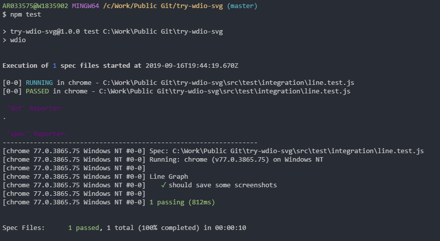
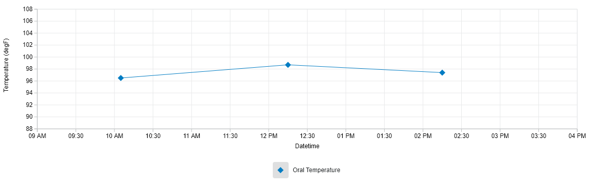
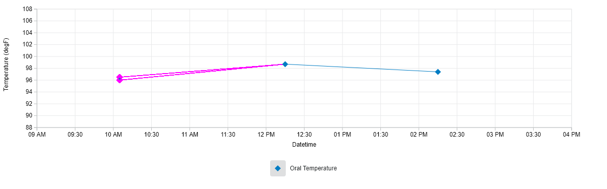

# try-wdio-svg

[](https://travis-ci.com/abhijit945/try-wdio-svg)

Test repo for WDIO with D3 SVG graphs

## Dependencies

`"@cerner/carbon-graphs"`

## DevDependencies

```
"@babel/cli": "^7.4.4",
"@babel/core": "^7.4.4",
"@babel/preset-env": "^7.4.4",
"@babel/register": "^7.6.0",
"@wdio/cli": "^5.13.0",
"@wdio/dot-reporter": "^5.12.1",
"@wdio/jasmine-framework": "^5.12.1",
"@wdio/local-runner": "^5.13.0",
"@wdio/selenium-standalone-service": "^5.12.1",
"@wdio/spec-reporter": "^5.12.1",
"wdio-timeline-reporter": "^5.0.12",
"@wdio/static-server-service": "^5.12.1",
"@wdio/sync": "^5.13.0",
"axe-core": "^3.3.2",
"babel-loader": "^8.0.5",
"wdio-image-comparison-service": "^1.5.1",
"webdriverio": "^5.13.0",
"webpack": "^4.40.2",
"webpack-cli": "^3.3.2",
"webpack-dev-middleware": "^3.7.1",
"webpack-dev-server": "^3.8.1",
```

## Output



### Actual

`Value of the first data-point is 98`



### Diff

`Value of the first data-point is changed to 98.5`



## Pending

-   [x] Add WDio 5
-   [x] Add Webpack as a custom service using `static-server` service
-   [x] Add `image-comparison` service
-   [x] Test if comparison works
-   [x] Axe a11y
-   [ ] Docker integration - Integration testing
-   [ ] TravisCI
-   [ ] Docker integration - Unit testing
